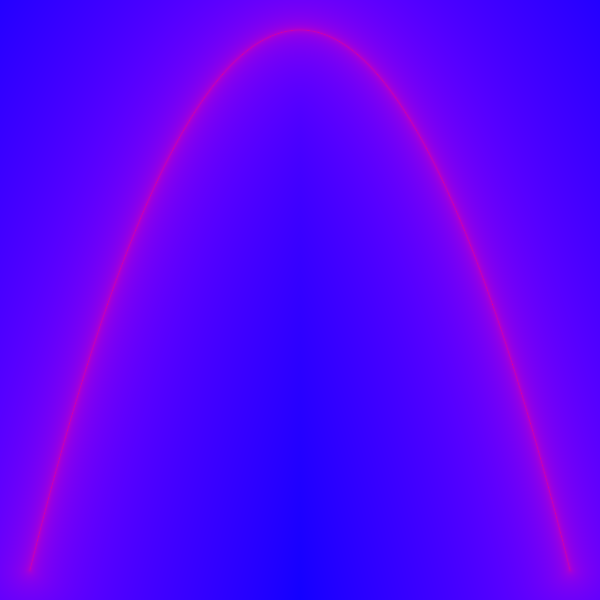

# Gpu Experiments

## Build & Run
Prerequisites: Rust toolchain (rustup.rs)

Platform Notes: Was built and tested on Linux. Path related issues may be present on Windows.

```bash
git clone https://github.com/it-is-zane/zgpu
cd zgpu
cargo run
```

## Interesting commits

[Font rendering](https://github.com/it-is-zane/zgpu/tree/e9818739ed12da7e5857ac8d94430e073b9bc7e6 "commit tagged with font_rendering")


[Hue excluding blur](https://github.com/it-is-zane/zgpu/tree/4c3d5f1f18063e12d14e2d89c986670878953487 "commit tagged with hue_excluding_blur")


[SDF bezier](https://github.com/it-is-zane/zgpu/tree/4a87d507d0974eaa61ab6bca6d97f1d229d94ffb "commit tagged with sdf_bezier")


